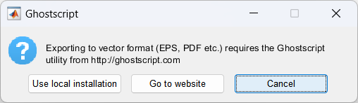

# MATLAB 图形导出比较

## 特性
- 全面比较 6 种常用的 MATLAB 图形导出方法：exportgraphics、print、saveas、export_fig、fig2svg、savefig
- 支持多种文件格式，包括 bmp、emf、eps、fig、gif、jpg、pdf、png、svg、tif
- 评估字体渲染，特别关注中文字符的处理（包括宋体和微软雅黑）
- 提供易用的脚本，用于测试各种导出场景
- 详细比较不同方法的优缺点和适用情况

## 使用方法

1. 运行 `main.m` 以生成并导出使用默认字体的英文文本的图像。

2. 运行 `main_SimSun.m` 以生成并导出使用默认字体宋体的中文文本图像。

3. 运行 `main_MSYH.m` 以生成并导出使用微软雅黑字体的中文文本图像。

4. 在 `saved_figures` 文件夹中比较生成的图像，观察不同格式、语言和字体（英文默认字体、中文默认字体宋体、中文微软雅黑字体）之间的渲染质量差异。

5. 每个脚本都会使用不同的导出方法和格式生成多个图像文件，便于全面比较。根据比较结果，选择最符合您需求的导出方法和格式。可以直接使用本工具导出的图像，或者使用 `export_graphics.m` 中相应的命令来导出您的最终图像。得到的图像适合于学术论文作图。

## 支持的格式和特性

### exportgraphics
- 支持：emf、eps、gif、jpg、pdf、png、tif
- 使用宋体时：pdf 中文字符显示为 '#'
- 使用微软雅黑字体时：eps 中文字符显示为宋体

### print
- 支持：emf、eps、jpg、pdf、png、svg、tif
- 使用微软雅黑字体时：pdf 和 eps 中文字符显示为宋体
- pdf 输出为 A4 页面大小
  
### saveas
- 支持：bmp、emf、eps、fig、jpg、pdf、png、svg、tif
- 使用微软雅黑字体时：pdf 和 eps 中文字符显示为宋体
- pdf 输出为 A4 页面大小
- 无法调整分辨率：（1）bmp，jpg：96dpi;（2）png，tif：150dpi
  
### export_fig
- 支持：bmp、emf、fig、gif、jpg、png、svg、tif
- svg 为灰色背景

### fig2svg
- 支持：svg
- svg 为灰色背景

### savefig
- 支持：fig

## 注意事项

1. 除上述特定情况外，其他情形下的导出结果通常能正常显示。
2. 仅包含英文文本，并且使用默认字体，通常图形导出问题较少。
3. 大多数导出格式都保留了不同程度的图像透明度，但在白色背景下可能不易察觉。
4. EPS 文件的显示效果评估基于使用 Adobe Acrobat 将 EPS 转换为 PDF 后的结果。
5. 使用 export_fig 导出含微软雅黑字体的图片时会出现以下提示，点击"Cancel"即可：

   

     
   

## 致谢

感谢以下仓库：
- [export_fig](https://github.com/altmany/export_fig)
- [fig2svg](https://github.com/kupiqu/fig2svg)

## 许可证

本项目采用 GNU 通用公共许可证 v3.0 (GPL-3.0) 授权。

## 联系方式

王敬 - wangjing@xynu.edu.cn

项目链接：[https://github.com/yuzhounh/matlab-figure-export-comparison](https://github.com/yuzhounh/matlab-figure-export-comparison)